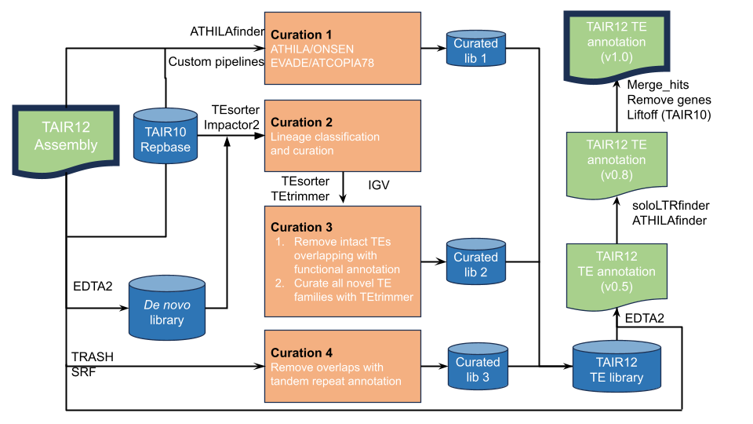

# TAIR12-TE
A repository to host scripts for annotating TEs in the Arabidopsis TAIR12 (Col-CC) genome

- Shujun Ou
- Alex
- Zhigui Bao
- Anna 

## Workflow

Here is the workflow what we used to annotate TAIR12




### Curation 1
Specific family curation from @Alex

### Curation 2
Lineage classification by `TEsorter` and `Impactor2`

### Curation 3
- Remove intact TEs overlapping with functional annotation
- Curate all novel TE families with TEtrimmer

### Curation 4
- Remove overlaps with tandem repeat annotatipn

### Finalization
Rerun `EDTA2` with  


#### soloLTR 


#### Merge hits

After obtaining initial annotations using **EDTA**, a post-processing step was conducted to merge annotated fragments.
The pipeline considers all neighboring fragments of the same family within a specific proximity. 
It then searches for a merged stretch over these fragments, including the regions between fragments, in the reference genomes.
If the copy number is high enough (at least 3 additional locations beyond its original position), this stretch is considered as an independent mobile sequence and is introduced into the annotation as a "parent".

The following parameters control the merging process:

- **P_SIM**: Percentage similarity threshold, set to `80%`.
- **P_COV**: Percentage coverage threshold, set to `95%`.
- **N_CNT**: Minimum number of additional occurrences required, set to `4`.
- **N_DIST**: Maximum distance between fragments, set to `1000`.


The pipeline requires the following input files:

1. **GFF File**: The `.gff` file containing initial annotations generated by EDTA.
   - Path: `data/gff/GCA_028009825.2_Col-CC_genomic.fna.mod.EDTA.TEanno.clean.rename.ORFinfo.soloLTR.ATHILA.ONSEN.Evade.TRASH.update_AGI.rm_overlap.20240925.gff3`

2. **Genome File**: The reference genome in FASTA format.
   - Path: `data/genome/GCA_028009825.2_Col-CC_genomic.fasta`

3. **Output Path**: The directory for storing output files from the merging pipeline.
   - Path: `data/out_merge/`


To execute the merging pipeline, please install [`pannagram`](https://github.com/iganna/pannagram) and use the following command:

```bash
conda activate pannagram 

P_SIM=80
P_COV=95
N_CNT=4
N_DIST=1000

TYPES="Mutator,LINE,hAT_TIR,DNA_transposon,LTR"

FILE_GFF="data/gff/GCA_028009825.2_Col-CC_genomic.fna.mod.EDTA.TEanno.clean.rename.ORFinfo.soloLTR.ATHILA.ONSEN.Evade.TRASH.update_AGI.rm_overlap.20240925.gff3"
FILE_GENOME="data/genome/GCA_028009825.2_Col-CC_genomic.fasta"

PATH_OUTPUT="data/out_merge/"

./merge_pipeline.sh -i  ${FILE_GFF} \
    -g  ${FILE_GENOME} \
    -o  ${PATH_OUTPUT} \
    -s ${P_SIM} \
    -c ${P_COV} \
    -n ${N_CNT} \
    -d ${N_DIST} \
    -p ${TYPES} \
    -v 

```

#### Liftoff with TAIR10

#### Remove false genes


